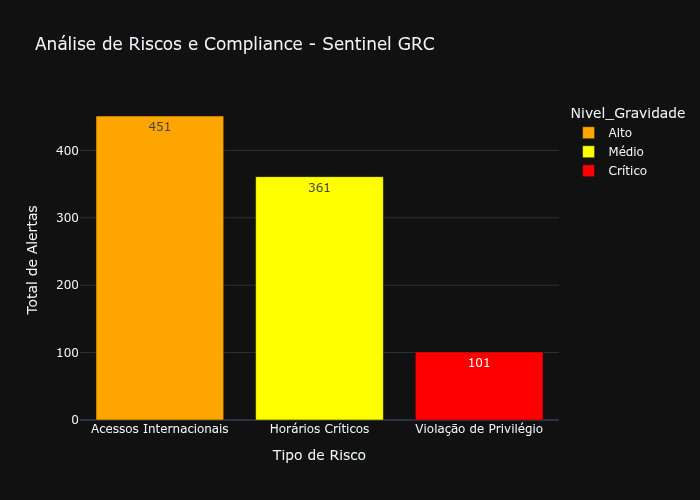

# 🛡️ Sentinel GRC - Auditoria e Compliance Automatizado

 

### 📺 Demonstração Prática (Gráfico de Acessos)
Confira abaixo a execução do projeto:


https://github.com/user-attachments/assets/c70630c7-73aa-4103-b39a-720f8d6cfe8e


<video src="NOME_EXATO_QUE_VOCE_DEU.mp4" width="100%" controls></video>

## 📝 Descrição do Projeto
O **Sentinel GRC** é uma solução de engenharia de dados aplicada à governança e conformidade. O sistema processa grandes volumes de logs de auditoria para identificar violações de acesso, horários críticos e acessos internacionais suspeitos, transformando dados brutos em inteligência estratégica.

---

## 🚀 Funcionalidades
* **Geração de Dados (Mock):** Simulação de 1.000 registros de auditoria.
* **Análise de Risco:** Identificação automática de violações de privilégio e acessos fora do horário comercial.
* **Dashboard Visual:** Geração de gráficos de barras para visualização imediata da gravidade dos alertas.
* **Relatórios Automáticos:** Exportação de alertas críticos em formato CSV para tomada de decisão.

---

## 🛠️ Stack Tecnológica & Infraestrutura
* **Linguagem:** Python 3.12 (Pandas para análise de dados).
* **Visualização:** Plotly e Kaleido para exportação de gráficos.
* **Desenvolvimento:** Baixo consumo de hardware (Lubuntu + Nano), otimizando a performance em ambientes limitados.
* **Versionamento:** Git & GitHub com deploy automático via GitHub Pages.

---


### 📂 Arquitetura e Organização
O projeto segue uma estrutura de pipeline de dados:


```text
/sentinel-grc
├── 📄 auditoria_grc.py      # Motor de análise e lógica de compliance
├── 📄 dashboard_grc.py     # Script gerador do painel visual
└── 📄 dashboard_grc.png    # Resultado final da análise (Dashboard)
├── 📄 acessos_auditoria.csv   # Base de dados de entrada
├── 📄 alertas_criticos.csv    # Relatório de riscos detectados)
└── 📄 README.md            # Documentação técnica e guia do projeto

---

Este projeto demonstra competências em **Engenharia de Dados**, **Segurança da Informação** e **Governança de TI**.# 🛡️ Sentinel GRC: Auditoria de Dados Automatizada

## 📖 Sobre o Projeto
O **Sentinel GRC** é um projeto de Engenharia e Análise de Dados desenvolvido para solucionar um problema real de Governança corporativa: a dificuldade de auditar manualmente milhares de registros de acesso em busca de irregularidades.

O foco aqui não foi apenas o código, mas a criação de uma **metodologia de auditoria contínua** capaz de identificar riscos críticos em milissegundos.

## 🎯 Objetivo e Finalidade
A finalidade deste projeto é fornecer aos gestores de Compliance uma ferramenta que:
1. **Reduza o erro humano** na identificação de acessos indevidos.
2. **Monitore a conformidade** com políticas de segurança da informação (como horários permitidos e restrições de cargo).
3. **Identifique ameaças externas**, mapeando acessos originados fora do país.

---

## 🏗️ Passo a Passo do Desenvolvimento

### 1. Modelagem de Dados (Ingestão/Mock)
Como o projeto foca em auditoria real, desenvolvi um script (`gerar_dados.py`) para simular uma base de dados "suja" com 1.000 registros, contendo variações de IP, país, horários e níveis de privilégio. Isso permitiu testar a robustez das regras de negócio.

### 2. Processamento e Limpeza (ETL)
Utilizei a biblioteca **Pandas** para tratar os dados brutos. O maior desafio técnico foi a manipulação de objetos de data e hora (Datetime), essencial para segmentar acessos feitos em janelas críticas de tempo.

### 3. Implementação de Regras de Compliance (O Cérebro)
Criei filtros lógicos para caçar três tipos de violações:
- **Risco Geográfico:** Acessos internacionais não autorizados.
- **Risco de Horário:** Tentativas de acesso em períodos de baixa vigilância (madrugada).
- **Risco de Privilégio:** Estagiários acessando documentos sensíveis (Folha de Pagamento e Código-Fonte).

### 4. Visualização Estratégica (BI)
O resultado foi consolidado em um relatório numérico e em um dashboard visual (`dashboard_grc.png`), transformando números complexos em indicadores acionáveis para a diretoria.

---

## 🛠️ Stack Tecnológica & Infraestrutura
- **Linguagem:** Python 3.12 (Pandas / Plotly)
- **Desenvolvimento de Baixo Consumo:** Todo o projeto foi codificado via **Terminal (CLI)** utilizando o editor **Nano**, otimizando a performance em ambiente Lubuntu com foco em eficiência de hardware.
- **Armazenamento:** Estrutura baseada em arquivos CSV para garantir portabilidade e rapidez.

---
*Este projeto demonstra competências de Análise de Dados, Programação Python e visão estratégica de Governança de TI.*
